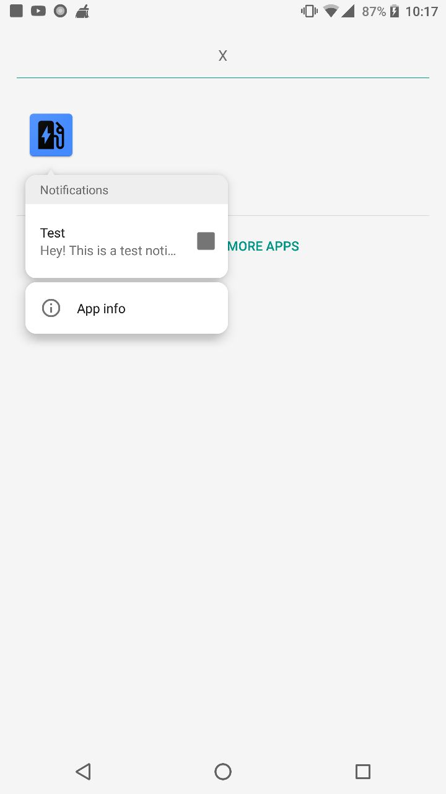

# Xamarin-Notification-Channel-Sample
Xamarin Notification Channel Sample for Android O

##### Importent Code
```csharp
NotificationChannel nChannel = new NotificationChannel(CHANNEL, "My First Channel", NotificationImportance.High);
nChannel.EnableVibration(true);
nChannel.SetShowBadge(true);

(NotificationManager)Application.Context.GetSystemService(Context.NotificationService)
	.CreateNotificationChannel(nChannel);
``` 
